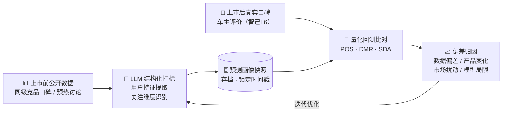
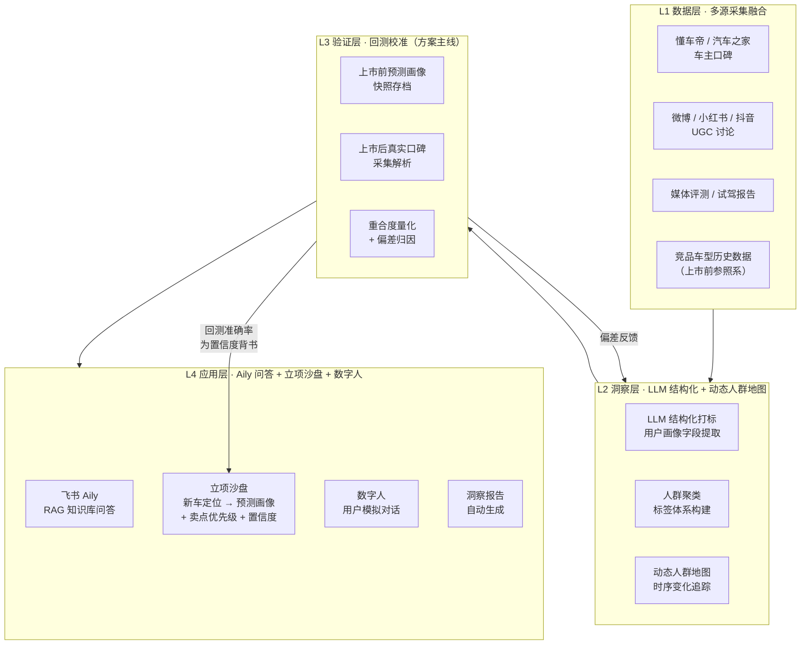

# 画像准确率引擎

> 「画像准确率引擎」——业内第一套给用户画像"打分"的洞察引擎：用历史回测量化画像准确率，用校准过的方法论支撑新车立项推演，用时间轴追踪画像动态漂移，让"画像准不准"从没人知道变成可量化、可归因、可持续改进的数字。
>
> 面向上汽乘用车「AI 驱动用户洞察引擎」命题的开题调研与原型仓库

---

## 痛点摘要

当前汽车行业用户洞察存在三个核心缺陷：

1. **知识不沉淀**：洞察报告以 PPT 形式存在，分析结论无法检索、复用和追踪，每次决策都在重新出发
2. **画像无验证闭环**：用户画像的预测准确率从未被量化——没有人知道上个季度的洞察到底对了多少
3. **竞品追踪不可规模化**：跨车型、跨平台的系统性竞品监测依赖人工阅读，无法响应市场变化速度

---

## 核心创新

三个模块环环相扣：**回测**是方法论校准的基石，**立项沙盘**把校准过的方法论用在"未来"的新车定位推演上，**漂移监测**把静态的画像快照变成持续更新的动态轨迹。三者共用同一套 L1/L2 数据与打标基础设施。

### 1. 画像回测机制（主线，方案灵魂）

本方案的核心创新是引入**可量化的画像回测闭环**：选择已上市车型作为"考题"——只使用其上市前已经存在的公开数据（同级竞品口碑、预热讨论）生成"预测画像"，与上市后真实车主口碑量化比对出的"实际画像"进行对比（人群重合度、卖点匹配率），对偏差来源逐一归因，反哺方法论持续校准。

回测目标车型：**智己 L6**（2024 年年中上市）；竞品参照系：**小米 SU7、飞凡 R7** 等同级竞品口碑，作为"上市前预测输入"的数据来源。

**五步闭环**：  
① 采集目标车型上市前的同级竞品口碑与预热讨论  
② LLM 结构化提取用户画像标签，生成预测分布并存档快照  
③ 上市后采集目标车型真实车主口碑，同样经 LLM 打标  
④ 以 Jensen-Shannon 散度、维度匹配率等指标量化两侧画像重合度  
⑤ 对低分维度逐一归因，反馈优化打标策略与数据源选择

### 2. 立项沙盘

直接回应命题原句"让每一款新车从立项起精准命中目标人群"：产品经理输入假想新车的定位（价位区间、细分市场、核心卖点方向），引擎自动圈定该细分市场的竞品口碑池，输出**预测人群画像 + 卖点优先级排序 + 置信度**。置信度不是凭空给出的——而是由画像回测机制在历史车型上验证过的准确率背书。

逻辑桥：回测不是"考古"，是让面向未来的预测有信用。

### 3. 画像漂移监测

利用口碑数据自带的时间戳，按季度切片，展示同一车型的用户画像与关注点如何随时间演化（例如：上市初期以科技尝鲜者为主 → 一年后家庭首购占比上升）。同一能力平移到竞品车型，即成为动态竞品追踪——不再是某个时间点的一张静态画像快照，而是持续更新的动态画像轨迹。

---

## 四层架构

---

## 仓库导航

| 目录 / 文件 | 说明 |
|-------------|------|
| [`docs/proposal.md`](docs/proposal.md) | 开题报告正文（四层架构 + 命题覆盖表） |
| [`docs/prompt-original.md`](docs/prompt-original.md) | 命题原文摘录（三个挑战 + 四个要求 + 目标句） |
| [`docs/architecture.md`](docs/architecture.md) | 四层架构详细说明 |
| [`research/industry-landscape.md`](research/industry-landscape.md) | 行业调研：现有洞察工具的不足与机会点 |
| [`research/benchmark-cases.md`](research/benchmark-cases.md) | 对标案例研究与竞品矩阵 |
| [`research/ugc-analysis.md`](research/ugc-analysis.md) | UGC 样本分析框架与质量评估 |
| [`research/references.md`](research/references.md) | 参考资料清单 |
| [`data-feasibility/feasibility-report.md`](data-feasibility/feasibility-report.md) | 各数据源可行性评估表 |
| [`data-feasibility/field-schema.md`](data-feasibility/field-schema.md) | 统一字段 Schema 说明 |
| [`pipeline/crawler/`](pipeline/crawler/) | 数据采集模块（含通用 HTTP 工具） |
| [`pipeline/llm_tagging/prompts/tagging_prompt.md`](pipeline/llm_tagging/prompts/tagging_prompt.md) | **LLM 结构化打标 Prompt 初稿**（含字段说明与示例） |
| [`backtest/design.md`](backtest/design.md) | **回测实验设计**（指标公式 / 数据源规划 / 偏差归因框架） |

---

## MVP Demo 范围与飞书工具链

比赛演示阶段采用小规模、可在有限时间内跑通的简化版闭环，正式规模的爬虫自动化与完整回测留待赛后放大（见"当前进度"）。demo 阶段各层对应的执行工具：

| 架构层 | 生产方案（长期目标） | Demo 阶段执行方式 |
|--------|----------------------|--------------------|
| L1 数据层 | 爬虫自动采集，样本量达到统计意义规模 | Playwright 采集懂车帝口碑，已验证可跑通多款车型（智己L6/飞凡R7/MG领航PHEV + 同级竞品），规模扩充中，具体条数视反爬解决进展确定 |
| L2 洞察层 | Python 脚本批量调用 LLM API 打标 | **飞书多维表格 AI 字段/公式**，复用 [`tagging_prompt.md`](pipeline/llm_tagging/prompts/tagging_prompt.md) 的字段定义与 evidence 要求，做人群筛选看板 |
| L3 验证层 | 严格按 T0 时间戳切分的上市前 / 后窗口回测（智己L6） | 将现有样本人为切分为两组模拟"预测组 / 真实组"，跑通一次完整 POS / DMR / SDA 计算，验证链路可行性 |
| L4 应用层 | 飞书 Aily RAG 问答 + 立项沙盘 + 数字人对话 | **飞书 Aily** 基于多维表格结构化结果回答，回答必须注明依据的样本 / 聚类与置信度；立项沙盘用现有同级竞品数据模拟一次"新车定位输入 → 预测画像输出"；数字人在 demo 阶段做静态"用户人物卡"视觉设计，暂不做对话式 AI |

demo 验证的是"文本进 → 结构化画像出 → 可筛选查询 → 带依据的 AI 问答 → 回测评分"这条完整链路能跑通，而不是最终样本规模。

---

## 当前进度

- [x] 仓库搭建与目录结构初始化
- [x] README 与架构文档完成
- [x] 数据可行性评估框架建立
- [x] LLM 打标 Prompt 初稿完成
- [x] 回测实验设计提纲完成
- [x] 爬虫跑通（懂车帝口碑页 Playwright 采集链路验证可行）
- [x] 7 款车型小样本采集（智己L6/飞凡R7/MG领航PHEV + 4 款同级竞品，每款小样本已入库）
- [ ] 数据规模扩充（翻页/反爬限制待解决，具体样本量视扩充进展确定）
- [ ] LLM 结构化打标
- [ ] 回测指标计算与偏差归因（POS / DMR / SDA / CBS）
- [ ] 画像漂移监测分析
- [ ] 飞书多维表格原型
- [ ] 立项沙盘演示

---

## 评估指标说明

| 指标 | 名称 | 含义 |
|------|------|------|
| **POS** | Profile Overlap Score | 预测画像与真实画像的分布相似度（JS 散度转化，越高越好） |
| **DMR@K** | Dimension Match Rate | Top-K 关注维度预测命中率 |
| **SDA** | Sentiment Direction Accuracy | 维度情感方向（正/负/中）预测准确率 |
| **CBS** | Composite Backtesting Score | 综合回测得分 = 0.5×POS + 0.3×DMR@5 + 0.2×SDA |

---

## 免责声明

- 所有数据均来源于公开渠道（懂车帝、汽车之家、微博、小红书等平台的公开内容）
- 数据仅用于本次竞赛研究目的，不用于商业用途
- 纳入分析的样本已完成脱敏处理，不含任何用户个人身份信息
- 本仓库不存储任何原始采集数据（`data/raw/` 已加入 `.gitignore`）
