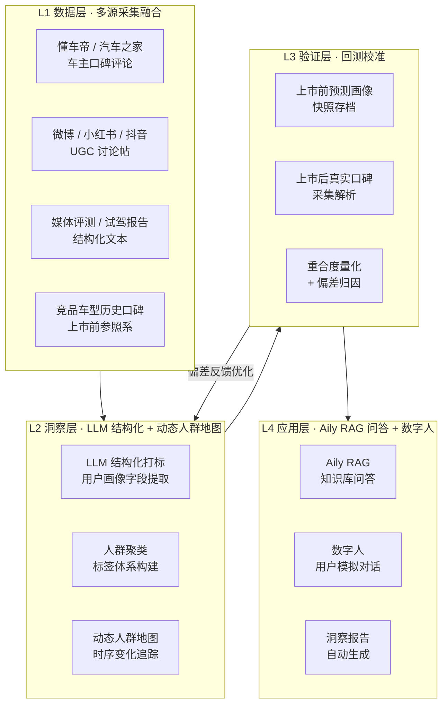

# 系统架构说明

本文档描述"可回测用户画像引擎"的四层技术架构及各层职责边界。

## 架构总览

## 各层职责说明

### L1 数据层
负责从多个公开渠道采集原始文本数据，统一清洗格式后写入数据湖。关键挑战：跨平台字段对齐、反爬策略、数据时效性管理。

### L2 洞察层
核心模块。通过 LLM 将非结构化评论转化为结构化用户画像标签（人生阶段、城市线级、购车动机、关注维度等），并聚合为可视化的人群地图。支持按时间窗口切片，追踪用户关注点随产品生命周期的变化。

### L3 验证层
项目核心创新所在。以上市日为时间锚点，将上市前预测画像与上市后真实画像进行量化比对，输出重合度分数并归因偏差来源。详见 [`backtest/design.md`](../backtest/design.md)。

### L4 应用层
将洞察结果接入飞书 Aily 生态，支持自然语言问答和数字人模拟目标用户进行产品沟通测试。
