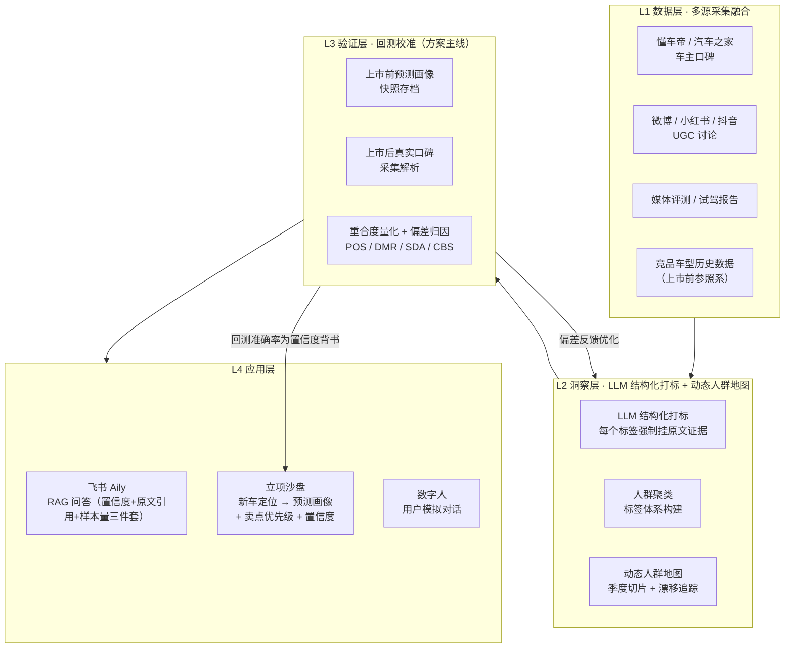

# 开题报告完整版

> **状态**：核心叙事已定稿，量化数值（回测准确率、重合度等）待实验产出后补充。所有涉及具体数字之处均以「X%（待实验产出）」占位，禁止编造。
> 参见 [`README.md`](../README.md) 获取项目整体概述与当前进度，参见 [`backtest/design.md`](../backtest/design.md) 获取回测方法论的完整细节。

---

## 1. 选题背景与意义

当前汽车行业的用户洞察普遍存在三个核心缺陷：

1. **知识不沉淀**：洞察报告以 PPT 形式存在，分析结论无法检索、复用和追踪，每次决策都在重新出发。
2. **画像无验证闭环**：用户画像的预测准确率从未被量化——没有人知道上一次的洞察到底对了多少，方法论无法迭代校准。
3. **竞品追踪不可规模化**：跨车型、跨平台的系统性竞品监测依赖人工阅读，无法响应市场变化速度，也无法沉淀为可复用的动态资产。

面向上汽乘用车「AI 驱动用户洞察引擎」的命题，本方案给出的回答是：**先证明画像准，再谈画像有用**。把"用户画像"从一份写完就过时的报告，变成一套持续被验证、持续被校准、持续可追溯的量化能力。

---

## 2. 核心创新点

三个模块环环相扣：**回测**是方法论校准的基石，**立项沙盘**把校准过的方法论用在"未来"的新车定位推演上，**画像漂移监测**把静态的画像快照变成持续更新的动态轨迹。三者共用同一套 L1 数据层与 L2 打标基础设施。

### 2.1 画像回测机制（主线，方案灵魂）

选择已上市车型作为"考题"——只使用其上市前已经存在的公开数据（同级竞品口碑、预热讨论）生成"预测画像"，与上市后真实车主口碑量化比对出的"实际画像"进行对比（人群重合度、卖点匹配率），对偏差来源逐一归因，反哺方法论持续校准。

- **回测目标车型**：智己 L6（2024 年年中上市）
- **竞品参照系**：小米 SU7、飞凡 R7 等同级竞品口碑，作为"上市前预测输入"的数据来源
- **产出**：准确率数字（POS / DMR / SDA / CBS，见 `backtest/design.md` 第 6 节）+ 偏差归因报告

这一步不是为了"证明我们很懂智己 L6"，而是为了证明"这套从竞品口碑推导目标人群的方法论本身是可信的"——这个可信度，正是立项沙盘敢于对未上市新车给出预测的底气。

### 2.2 立项沙盘

直接回应命题原句"让每一款新车从立项起精准命中目标人群"：

1. 产品经理输入假想新车的定位（价位区间、细分市场、核心卖点方向）
2. 引擎自动圈定该细分市场的竞品口碑池
3. 输出**预测人群画像 + 卖点优先级排序 + 置信度**

置信度不是凭空给出的——而是由 2.1 节回测机制在历史车型（智己 L6）上验证过的准确率背书。逻辑桥：**回测不是"考古"，是让面向未来的预测有信用**。

### 2.3 画像漂移监测

利用口碑数据自带的时间戳，按季度切片，展示同一车型的用户画像与关注点如何随时间演化（例如：上市初期以科技尝鲜者为主 → 一年后家庭首购占比上升）。同一能力平移到竞品车型，即成为动态竞品追踪——不再是某个时间点的一张静态画像快照，而是持续更新的动态画像轨迹，也让 2.1 节的回测比对有了"分阶段"而非"一刀切"的精细度。

---

## 3. 四层架构

### L1 数据层

多源采集 + 统一 `field-schema`（见 [`data-feasibility/field-schema.md`](../data-feasibility/field-schema.md)），已用 Playwright 采集链路在懂车帝口碑页验证跑通，覆盖智己 L6、飞凡 R7、MG 领航 PHEV 及多款同级竞品车型。关键挑战：跨平台字段对齐、反爬策略、数据时效性管理——当前反爬问题（翻页/会话稳定性）仍在解决中，样本规模随之扩充。

### L2 洞察层

通过 LLM 将非结构化评论转化为结构化用户画像标签（人生阶段、购车动机、性别、关注维度等）。**每个标签强制挂原文证据**，避免"黑箱打分"。城市线级不经过 LLM，由结构化购车地点字段确定性映射得出，可靠性更高。聚合为可视化的人群地图，支持按季度切片，追踪用户关注点随产品生命周期的动态漂移。

### L3 验证层（回测，方案主线）

- **预测输入**：目标车型（智己 L6）上市日之前的同级竞品口碑 + 预热讨论
- **验证基准**：目标车型上市后的真实车主口碑
- **指标**：人群重合度（POS）、卖点匹配率（DMR）、情感方向一致率（SDA）、综合得分（CBS）——公式与计算思路见 [`backtest/design.md`](../backtest/design.md) 第 6 节
- **产出**：准确率数字（X%，待实验产出）+ 偏差归因报告（数据偏差 / 产品变化 / 市场扰动 / 模型局限）

### L4 应用层

- **飞书 Aily 问答**：每次回答强制给出「置信度 + 原文引用 + 样本量」三件套，杜绝无依据的臆断
- **立项沙盘**：见 2.2 节
- **数字人**：基于结构化画像生成静态用户人物卡，模拟目标用户对产品定位的反应（demo 阶段为静态卡片，不做对话式 AI）

---

## 4. 命题覆盖表

> 命题原文见 [`docs/prompt-original.md`](prompt-original.md)。

### 4.1 三个真实挑战 → 对应模块

| 命题挑战原文 | 对应模块 | 对应章节 |
|------|------|------|
| **洞察深度与覆盖面不足**：依赖研究员主观判断，难以覆盖海量 UGC，颗粒度粗，知识无法沉淀复用（散落在 PPT/文档，只能管理层流转） | L2 洞察层：LLM 结构化打标规模化覆盖海量 UGC，每个标签强制挂原文证据；沉淀为飞书多维表格 + Aily 问答，全员可查而非管理层专属 | 3. L2 洞察层 |
| **数据结论准确率低**：画像形成的产品决策上市后偏差较大（实际用户与画像不统一、卖点与市场反馈不一致），缺少可被验证的画像机制 | L3 验证层（画像回测机制，方案主线）：用已上市车型量化"预测画像 vs 实际画像"的偏差，并归因，这正是命题要求的"可被验证的画像机制" | 2.1、3. L3 验证层 |
| **竞品追踪能力薄弱**：受人力限制，过去只能研究少数核心竞品，无法对 10+ 竞品车型持续动态追踪对比 | L2 画像漂移监测（同一能力平移到任意数量竞品，按季度持续追踪）+ 立项沙盘的竞品口碑池自动圈定（不再依赖人工逐个竞品阅读） | 2.3、2.2 |

### 4.2 四个要求（"AI 机会"段）→ 对应模块

| 命题要求原文 | 对应模块 | 对应章节 |
|------|------|------|
| 多源数据的智能采集与融合 | L1 数据层：多平台采集 + 统一 field-schema | 3. L1 数据层 |
| 多维度人群地图的动态构建（人生阶段 × 城市线级 × 年龄 × 性别等实时下钻） | L2 洞察层：LLM 结构化打标 + 人群聚类 + 动态人群地图[1] | 3. L2 洞察层 |
| 产品经理可随时调用的 AI 问答洞察能力 | L4 应用层：飞书 Aily 问答（置信度 + 原文引用 + 样本量三件套） | 3. L4 应用层 |
| 基于真实用户画像的车型模拟数字人原型 | L4 应用层：数字人（demo 阶段静态用户人物卡） | 3. L4 应用层 |

[1] **人生阶段 × 城市线级 × 购车动机是当前实现的核心下钻维度**（城市线级由结构化购车地点确定性映射，人生阶段/购车动机由 LLM 打标产出，覆盖率均在 85%~90% 区间）。**性别**作为补充维度保留（评论文本间接推断覆盖率约 11%，和人生阶段相当，样本量能支撑基础下钻，但暂不计入核心回测指标）。**年龄**实测后决定暂不纳入——评论文本里能推断年龄的间接线索覆盖率仅约 2.7%，且还需再细分多个年龄段，样本量对每个分档来说没有统计意义，强行加入容易变成模型瞎猜，与"每个标签强制挂原文证据"的核心原则冲突。规划后续接入行为数据/交强险数据等其他数据源，补全年龄维度的人群地图能力。

### 4.3 目标句 → 对应模块

> "将用户研究的响应周期从'等报告'（数周）压缩至'即时查'（分钟级），让每一款新车从立项起就精准命中目标人群。"

- **"等报告"→"即时查"**：对应 L4 飞书 Aily 问答——结构化数据沉淀在多维表格中，问答分钟级响应，取代"等研究员写 PPT"
- **"每一款新车从立项起精准命中目标人群"**：对应 2.2 节**立项沙盘**——新车定位输入即可输出预测画像 + 卖点优先级 + 置信度，而这个置信度由 L3 回测机制在历史车型上验证过的准确率背书，不是空口承诺

---

## 5. 预期成果与评估标准

| 成果 | 形式 | 状态 |
|------|------|------|
| 智己 L6 回测报告 | POS / DMR / SDA / CBS 数值 + 偏差归因 | X%（待实验产出） |
| 立项沙盘 demo | 一次完整的"新车定位输入 → 预测画像输出"演示 | 待实现 |
| 画像漂移分析 | 至少一款车型的季度画像演化对比 | 待实现 |
| 飞书多维表格原型 | 人群筛选看板 + Aily 问答 | 待实现 |

评估标准与指标公式详见 [`backtest/design.md`](../backtest/design.md)；数据规模与字段完整率详见 [`data-feasibility/`](../data-feasibility/) 目录（`data-overview.md` 待生成）。

---

## 6. 团队分工与里程碑

里程碑安排见 [`backtest/design.md`](../backtest/design.md) 第 9 节。
